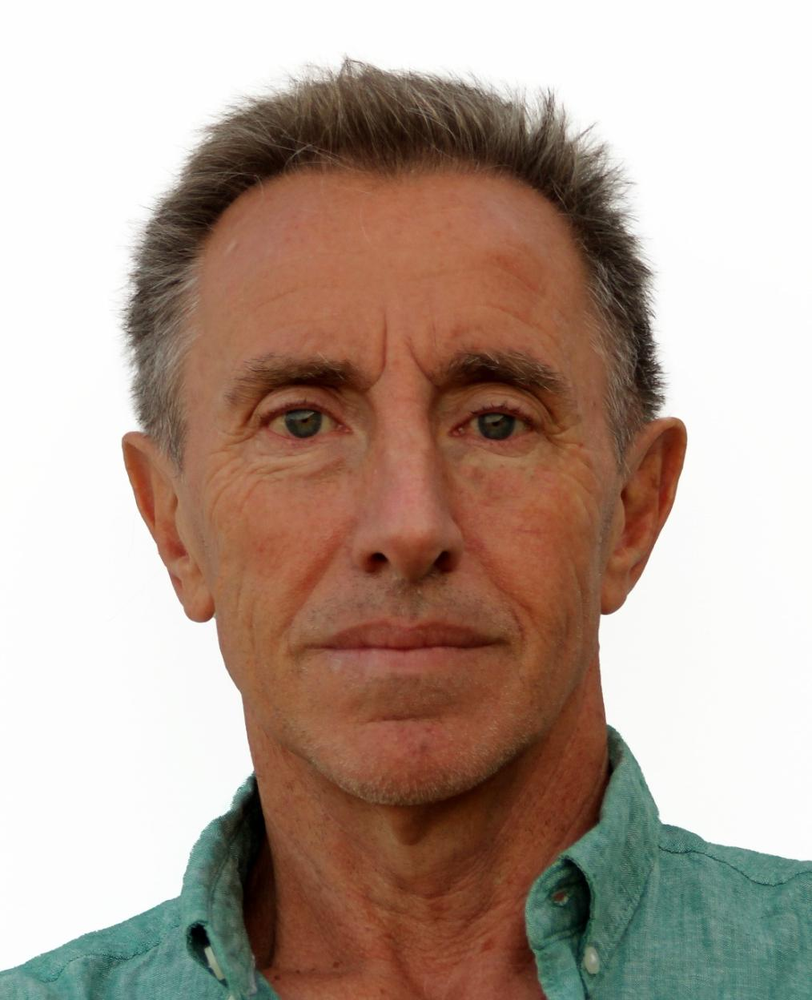
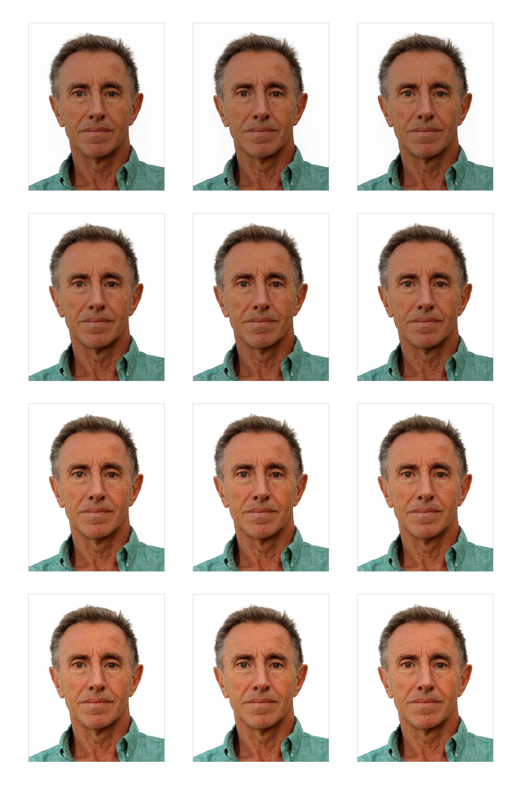

# Generador de Fotografías Tamaño Carnet para DNI Español

<table>
    <tr>
        <td> </td>
        <td>Este proyecto en un Notebook Jupyter de Python permite generar de manera sencilla una cuadrícula de <strong>12 fotografías tamaño carnet</strong> (32x26 mm) a partir de una fotografía no ajustada. Ideal para obtener múltiples fotos para documentos oficiales, ajustadas a las dimensiones requeridas para el <strong>DNI español</strong>.</td>
    </tr>
</table>


## Descripción del Proyecto

El objetivo es que con solo dos clicks, se pueda procesar una imagen de retrato y generar una **superimagen en una cuadrícula de 3x4** que contenga 12 fotografías tamaño carnet. 

* Pon la url de la imagen en el código y ejecuta las 3 primeras celdas. Te pedirá dos clicks:
* El primer click se realiza justo a la altura del pelo
* El segundo click bajo la barbilla
* Ejecuta el resto de celdas


Las fotos se recortan y ajustan a las proporciones necesarias, y se añaden tres versiones con ajustes de brillo (ajustables) para adaptarse a diferentes condiciones de impresión.

 &rarr;  &rarr; 


## Características

Estos son cosas del chatGPT que me hizo el borrador del readme:

- **Proporciones Correctas**: Las fotos se recortan con una relación de aspecto de 26:32 (ancho x alto), cumpliendo con las dimensiones oficiales del DNI español.
- **Brillo Ajustado**: Además de la imagen original, se generan versiones con más o menos de brillo.
- **Cuadrícula 3x4**: Las fotos se organizan en una superimagen en formato de cuadrícula de 3x4, con un borde gris y un espaciado uniforme.

## Requisitos

Instala las siguientes bibliotecas antes de ejecutar el proyecto:

```bash
pip install pillow matplotlib ipympl
```

## Cómo Usar
* Carga la Imagen: Ejecuta el notebook e introduce la ruta de la imagen de retrato que deseas procesar.
* Define los Puntos de Recorte: Selecciona dos puntos clave en la imagen (la parte superior de la cabeza y la barbilla) para definir el recorte en proporción al rostro.
* Genera la Superimagen: Ejecuta las celdas finales para generar una imagen de 3x4 con 12 fotos tamaño carnet, incluyendo las versiones con ajustes de brillo.

## Ejemplo de Resultado


## Configuración de Dimensiones y Espaciado

Tamaño de Foto Individual: Cada fotografía se recorta según las dimensiones oficiales de 26 mm de ancho por 32 mm de alto.

Espaciado y Bordes: Las fotos en la superimagen se presentan con un espaciado equidistante y un borde gris de 1 píxel, lo que facilita el recorte manual de cada fotografía.

## Personalización

Puedes ajustar el espaciado o el color del borde en el código, según tus preferencias o necesidades específicas de impresión.

## Licencia
Este proyecto está bajo la licencia MIT. Puedes usarlo y adaptarlo libremente.

